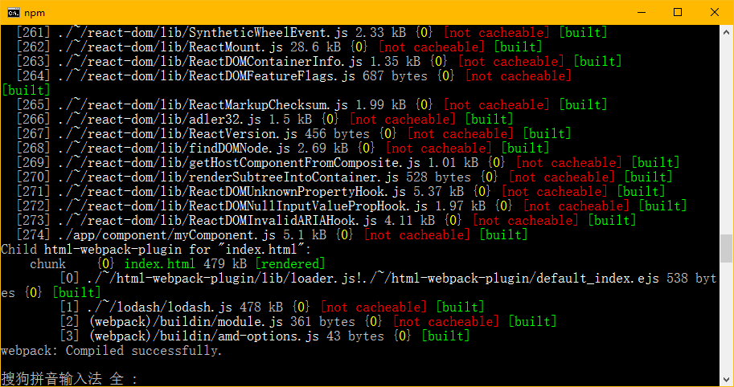

# react-study

## 配置`Babel`让`React`支持`ES6`
其实，在学习es6的时候，这些我已经安装过了，如果没安装过的则可以按以下方法进行安装和配置。
### 安装`babel-loader`
```
npm install babel-loader --save-dev
npm install babel-preset-es2015 babel-preset-react --save-dev
```
- `babel-preset-es2015`: es6语法转换。
- `babel-preset-react`: react转码规则，让你在代码中可以使用React ES6 classes的写法，同时直接支持JSX语法格式。

### 配置webpack
`webpack.config.js`:
```
...
module: {
    //加载器配置  告知webpack每一种文件都需要什么加载器来处理
        loaders: [
            {
                test: /\.jsx?$/,   //用来匹配js和jsx文件
                loader: "babel-loader",
                exclude: /node_modules/,  //屏蔽不需要处理的文件（文件夹）（可选）
                query: {presets: ['es2015', 'react']}
            }
        ]
    }
...
```

注：在对jsx文件进行转码配置的时候，如果不加`exclude:...`，就会导致`webpack-dev-server`运行速度变慢，而且终端会显示很多的文件没有被`[not cacheable]`，`enclude`的意思是屏蔽一些不需要处理的文件，因为我们的`node_modules`文件夹里有很多js文件，屏蔽掉之后，`webpack-dev-server`的运行速度才算是正常的速度。下图是没有屏蔽`node_modules`文件夹时出现的情况：


### 安装`react`和`react-dom`
```
npm install react react-dom --save
```

如果想使用`bootstrap`的话可以安装一下
```
npm install bootstrap --save-dev
```

如果要引用的话，直接在文件中引入即可
```
import '../node_modules/bootstrap/dist/css/bootstrap.min.css'; 
```

如果要使用sass的话，需要安装`sass loader`加载器，来对`scss`文件进行转换，输入以下命令进行安装
```
npm install sass-loader --save-dev
```

在`webpack.config.js`里配置加载器
```
...
module: {
    //加载器配置  告知webpack每一种文件都需要什么加载器来处理
        loaders: [
            {test: /\.scss$/, loader: "sass-loader"},
        ]
    }
...
```

